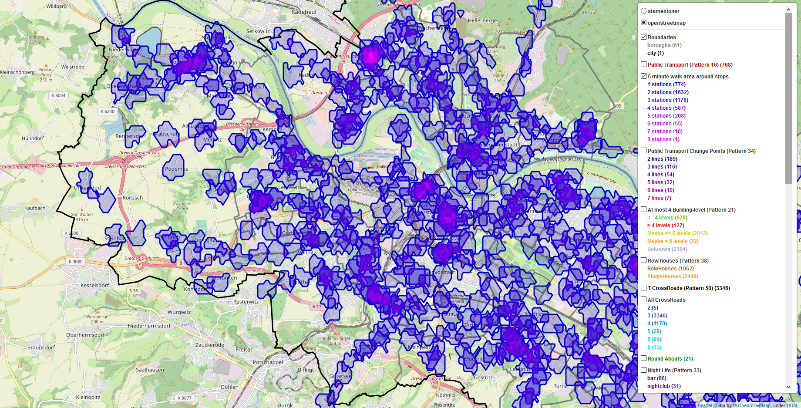

# Urban Data Seminar

This project was created as part of the `Urban Data Seminar` at the TU Dresden.
It fetches data mostly from openstreetmap, but also from other sources as dvb for public transport, [TravelTime](https://app.traveltimeplatform.com/) for time maps and yellow pages as well as the handelsregister for additional data regarding companies. 
Examples maps produced by the scripts explained in the following can be found [here](example_maps/).
Each map has a layer control at the upper right, where you can enable and disable individual layers as well as changing the base-tiles.

1. [Content/Scripts](#contentscripts)
    1. [BuildingComplexes](#buildingcomplexes)
    2. [City Patterns](#city-patterns) 
2. [Getting started](#getting-started)    
3. [Package dependency](#package-dependency)         
4. [Further ideas](#further-ideas)

## Content/Scripts

### BuildingComplexes
The simplest script is the [`urbanDataMap.py`](urbanData/urbanDataMap.py) which just fetches relevant openstreetmap data and visualizes it in a map. 
At the beginning the idea was group buildings and find building regions, which can be seen in the [`buildingComplexes.py`](urbanData/buildingComplexes.py) script.
Resulting are building-groups (buildings having at least one common point) and building-regions (building-groups not being further apart then 120 meters and having no street in between).
As the data from openstreetmap is not complete, f.i. many buildings are just tagges as _yes_, an additional building-type is introduced (see [`annotater/buildingClassifier.py`](urbanData/annotater/buildingClassifier.py)).
There are several other properties annotated as seen in the `annotater` package.
Currently the analysis is only done over Pieschen.
Note that regions only contain the buildings and not the space inbetween (regarding area and shape).
Overlapping regions exist only visually as the convex hull of the shapes are used (could not find a good method to improve shape based on region borders).

For more images of a building map see [here](images/)

The describtion of the individual objects is based on the annotaters executed in the script.
The most properties should be self explaining, otherwise you can look at the regarding annotator.
Regarding the _buildingArea_ property, _Total area in m2_ is a calculated by _ground area * levels_.  

### City Patterns
The [`cityPatterns.py`](urbanData/cityPatterns.py) script uses the results from the `buildingComplexes` script and tries to find patterns as described by Christoph Alexander in `A Pattern-Language`.
Besides his patterns, which were also partly modified, also others can be found in the map. 
The patterns are visualized simply by highlithing the corresponding objects, but also Voronoi-Diagrams and TimeMaps exists, to show the coverage (f.i. public transport stops are have a 5-Minute-Walk area).

The city-pattern map includes the following layers:
* 2 different tiles 
  * the standard _openstreetmap_ 
  * a minimalistic called _stamentoner_
* a boundary layer showing the boarder of Dresden as well as its boroughs
* Public Transport:
  * Each stop (Pattern 16)
  * Public Transport Change Points (Pattern 34): each stop used by more than 2 lines (not counting temporary lines and stops only for getting off)
  * heatmap regarding 5 minute walking areas around stops
* At most 4 Building-level (Pattern 21, only in Pieschen):
  * The _Maybe_ classification depends on estimations made based on the surrounding buildings
  * _Unknown_ is used, if no surrounding building had a level information
* Row houses (Pattern 38, only in Pieschen):
  * includes only residential buildings (or buildings which could not be classified)
  * Row houses are houses with more than 1 address here (as rowhouses are partly mapped in openstreetmap as one large building)
* Cross Roads:
  * T-CrossRoads (Pattern 50): Crossroads with exactly 3 edges
  * All CrossRoads: grouped by their an estimation of their number of edges
  * Roundabouts: as a possibly new pattern
* Night Life (Pattern 33):
  * classified based on their amenity tag in openstreet map (allowing bars, nightclubs and pubs)
* Town Halls (Pattern 44):
  * including the official town hall areas as well as each town hall
  * 15 public-transport minute areas around town halls as an extra layer
* Health Care (Pattern 47):
  * differentiating between pharmacies and doctors
  * 5 minute walking areas around pharmacies (doctors have different specializations)
* Holy Ground (Pattern 66 & 70):
  * including places of worship like churches and cementries
* LocalSport (Pattern 72) (sport clubs but also areas tagged for sport activities)
* Local grocery stores (Patter 89): differing between supermarkets, small convienience shops, butchers, bakeries and pastries
* Open at midnight (based on Pattern 90):
  * places open at the middle of the night like "doener imbiss" or "spaeties". mostly fast-food and gas-stations
  * also including places which have an open-end
  * 5 minute walking areas around these places as an extra layer
* Green areas: parks, allotments, forests and garden
* Multiple voronoi diagrams for getting an simple partition of dresden (f.i. a region for each supermarket) 

## Getting started

The current scripts are for Dresden.
Executing the scripts for the first time can take quite a while as many data from openstreetmap needs to be pulled (responses will be cached, so subsequent execution will be faster).

If you change the city you should note the following:
* Be sure when __executing the scripts__ to be __inside the [`urbanData`](/urbanData) folder__ (otherwise there may be problems finding helper and annotater classes)
* The tags the analysis is based on may have different meanings and/or values if you change the city 
* The scraped company data for Dresden is uploaded. For other cities they need to be scraped by yourself.
* If you want to include data for the public transport you need to find a corresponding API as dvb will probably not work. 
* If you want to build your own time maps ([`timeMapRetriever.py`](urbanData/timeMapRetriever.py) might be a good starting point), you will need your own __API-KEY__
* You may notice the introduced pauses, which are introduced to respect the allowed request per minute limit for the free usage of TimeMaps.

 

## Package dependency 

Visualization:
- [folium](https://github.com/python-visualization/folium) (fronted/map visualization)
- matplotlib (mostly for their color maps)
- scipy (for Voronio diagrams)
- numpy (also just for Voronoi diagrams)

Fetching data:
- OSMPythonTools (for access to openstreetmap services e.g. overpass and nomantin)
- scrapy (for scraping yellow pages and handelsregister for company data)
- [dvb](https://github.com/kiliankoe/dvbpy) (for accessing data from the public transport provider for dresden)
- requests (sending requests to web services like timemap)
- OWSLib (for request on WMS and WFS for openDataDresden, currently only as an experiment)
  
Data Processing:
- geojson (data format assumed in most of the functions)
- [shapely](https://github.com/Toblerity/Shapely) (operations on geometries and r-tree index)
- [networkx](https://github.com/networkx/networkx) (graph approach for grouping objects via connected components)
- pyproj (for projection between WGS84 and UTM coordinates)
- geopandas
- pandas  

Util:
- json 
- logging
- time 
- re
- abc (for abstract methods)
- dataclasses (something like scalas `case classes`)
- collections (like defaultdict)

## Further ideas 

* use data from openDataDresden and other sources (using their wms and wfs services)
* use multi-threading f.i. finding buildingRegions
* use streamlit for an interactive web app (allowing to interactivly add voronoi layers f.i.)
* write way more tests
* improve housenumber recognition out of an address
* improve crossroads edgeCount estimation (or use OSMnx for getting crossroads)
